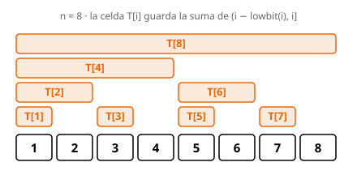

# Fenwick Tree (BIT)

!!! info "Metadata"
    **Level:** Intermediate · **Difficulty:** 3.0 · **Complexity:** O(log n) per operation

A **Fenwick tree** (or *Binary Indexed Tree*) maintains prefix sums of an array while
allowing **point updates** and **range queries**, both in **O(log n)**. It is the ideal
structure when the array changes and we need range sums many times.

<figure class="algo-figure">
  
  <figcaption>Each cell <code>T[i]</code> stores the sum of a block ending at position
  <code>i</code> whose size is the lowest set bit of <code>i</code>.</figcaption>
</figure>

## Idea

A prefix-sum array answers queries in O(1), but changing a single element forces an O(n)
rebuild of the prefixes. A Fenwick tree splits the information into **blocks of different
sizes** so that both updating and querying touch only O(log n) blocks.

Internally the indices are **1-based** (the user's 0-based position `p` lives at internal
position `p + 1`). Cell `T[i]` stores the sum of the half-open range `(i − lowbit(i), i]`,
where `lowbit(i)` is the **lowest set bit** of `i`:

- `lowbit(i) = i & -i`. In two's complement, `-i` flips every bit and adds 1, so `i & -i`
  keeps only the lowest set bit. That value is both the **size** of the block covered by
  `T[i]` and the **jump** we take while walking the tree.
- Odd indices (`lowbit = 1`) cover a single element; powers of two cover a large block
  (`T[8]` covers all 8 positions).

`update` and `query` walk the tree in **opposite directions**:

- **`update(index, delta)`** walks up: from the position, repeat `index += index & -index`.
  Each jump lands on the next cell whose block *contains* that position, so every affected
  block is updated (at most O(log n)).
- **`query(index)`** walks down: repeat `index -= index & -index`. Removing the lowest set
  bit jumps to the block just before it; the visited blocks are disjoint and **tile**
  exactly `[0, index)`. Since each step clears one bit, there are at most O(log n) steps.

Queries are **half-open**: `query(index)` returns the sum of `[0, index)`, and a range
sum is the difference of two prefixes: `query_range(l, r) = query(r) − query(l)`.

## Example

Start from an array of 5 zeros and apply the test operations: `update(0, 3)` then
`update(2, 5)`. The logical array becomes `a = [3, 0, 5, 0, 0]`.

After both updates the internal cells (1-based) hold:

| Cell | Covers (1-based positions) | Value |
|------|----------------------------|-------|
| `T[1]` | `{1}`       | `3` |
| `T[2]` | `{1, 2}`    | `3` |
| `T[3]` | `{3}`       | `5` |
| `T[4]` | `{1, 2, 3, 4}` | `8` |
| `T[5]` | `{5}`       | `0` |

Now `query(3)` (sum of `[0, 3)`) walks down from `index = 3`: add `T[3] = 5`, jump to
`3 − 1 = 2`, add `T[2] = 3`, jump to `0`. Total `5 + 3 = 8`. Note that the blocks `(2, 3]`
and `(0, 2]` cover exactly the first three positions without overlapping.

Likewise `query(5)` adds `T[5] = 0` and `T[4] = 8`, giving `8`. Hence
`query_range(0, 3) = 8` and `query_range(0, 5) = 8`, the example's expected output.

## Code

=== "C++"

    === "full"

        ```cpp
        --8<-- "content/data-structures/fenwick-tree/code/fenwick.v1.full.cpp"
        ```

    === "clean"

        ```cpp
        --8<-- "content/data-structures/fenwick-tree/code/fenwick.v1.clean.cpp"
        ```

    === "contest"

        ```cpp
        --8<-- "content/data-structures/fenwick-tree/code/fenwick.v1.contest.cpp"
        ```

=== "Python"

    === "full"

        ```python
        --8<-- "content/data-structures/fenwick-tree/code/fenwick.v1.full.py"
        ```

    === "clean"

        ```python
        --8<-- "content/data-structures/fenwick-tree/code/fenwick.v1.clean.py"
        ```

    === "contest"

        ```python
        --8<-- "content/data-structures/fenwick-tree/code/fenwick.v1.contest.py"
        ```


## Complexity

| Operation | Complexity | Reason |
|-----------|------------|--------|
| Build | O(n) | allocate the vector of `n` zeros |
| `update` | O(log n) | walks up jumping block by block, one per bit |
| `query` | O(log n) | walks down adding disjoint blocks, one per set bit |
| Memory | O(n) | one cell per element |

## When to use it

- **Changing array + many range sums** → Fenwick tree. This is where it shines: both
  operations in O(log n) with very little code and a small constant.
- **Static array** (never changes) → a plain precomputed **prefix-sum** array answers in
  O(1) and is simpler; you do not need a Fenwick tree.
- **More general operations** (range max/min, range assignment, *lower-bound* searches)
  → a **segment tree** is more flexible at the cost of more code. The Fenwick tree is
  its lightweight version for sums.

!!! tip "Trick"
    For *range updates* with *point queries*, apply the Fenwick tree on the **difference
    array**: `update(l, +v)` and `update(r, −v)` add `v` to the whole `[l, r)`.

## Common pitfalls

- Mixing up **0-based** (public interface) and **1-based** (internal). The `index++` at
  the start of `update` performs that conversion; do not duplicate it.
- Forgetting that queries are **half-open**: `query_range(l, r)` excludes `r`. For the
  inclusive sum of `[l, r]` use `query_range(l, r + 1)`.
- Sizing the tree wrong: the loop in `update` checks `index <= n`, so the vector must
  have room for the `n` 1-based positions.

## Practice

| Name | Difficulty | Link |
|------|------------|------|
| fenwick | 4.0 | [Kattis](https://open.kattis.com/problems/fenwick) |
| supercomputer | 2.7 | [Kattis](https://open.kattis.com/problems/supercomputer) |

## References

- [CP-Algorithms: Fenwick Tree](https://cp-algorithms.com/data_structures/fenwick.html)
