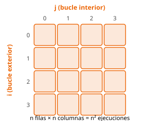

# Bucles en C++

[:octicons-arrow-left-24: Volver a Bucles](index.md)

## `for` — número conocido de repeticiones

```cpp
for (int i = 0; i < n; i++) {
    // se ejecuta n veces, con i = 0, 1, ..., n-1
}
```

Las tres partes son: **inicialización** (`int i = 0`), **condición** (`i < n`, comprobada
*antes* de cada vuelta) y **actualización** (`i++`, al final de cada vuelta). Fíjate en
que `i` llega hasta `n-1`, **no** hasta `n`: con `<` das exactamente `n` vueltas.

## `while` — hasta que se cumpla una condición

```cpp
while (condicion) {
    // se repite mientras `condicion` sea verdadera
}
```

Úsalo cuando **no sabes de antemano** cuántas vueltas hará (por ejemplo, dividir un
número entre 2 hasta que valga 1). La [condición](../conditionals/index.md) es la misma
que la de un `if`. Asegúrate de que algo dentro del cuerpo la acerca a volverse falsa, o
el bucle no terminará nunca.

## `do … while` — al menos una vez

```cpp
do {
    // se ejecuta y LUEGO se comprueba: siempre corre al menos una vez
} while (condicion);
```

## `break` y `continue`

Dos formas de alterar el flujo desde dentro del cuerpo:

```cpp
for (int i = 0; i < n; i++) {
    if (v[i] == objetivo) break;      // encontrado: salir del bucle YA
    if (v[i] < 0) continue;           // ignorar negativos: saltar a la vuelta siguiente
    suma += v[i];
}
```

- **`break`** abandona el bucle inmediatamente (útil para parar en cuanto encuentras algo).
- **`continue`** salta el resto del cuerpo y pasa a la siguiente iteración.

En bucles anidados, `break` y `continue` afectan **solo al bucle más interno** que los
contiene.

## Recorrer contenedores

<!-- TODO (trabajo futuro): enlazar con "Iteradores" (../iterators/index.md) cuando esa
     página tenga contenido — el `for (x : v)` se apoya en el concepto de iterador. -->

Para recorrer un `vector` (o cualquier contenedor) tienes dos opciones:

```cpp
for (int i = 0; i < (int) v.size(); i++)  // con índice: sabes la posición i
    cout << v[i] << " ";

for (int x : v)                           // "range-based for": solo el valor
    cout << x << " ";

for (int& x : v)                          // con `&` puedes MODIFICAR cada elemento
    x *= 2;
```

Usa el índice si necesitas la posición o comparar con la anterior; usa `for (x : v)`
cuando solo te interesa el valor (más corto y difícil de equivocarse).

!!! warning "Compara `i` con un `int`"
    `v.size()` es un tipo **sin signo**. En `i < v.size()`, con `v` vacío la resta puede
    dar sorpresas; el `(int) v.size()` del ejemplo evita esos líos al comparar con `int`.

## Bucles anidados y su coste

Un bucle dentro de otro multiplica el número de vueltas. Con dos bucles de tamaño `n` el
cuerpo interior se ejecuta `n · n = n²` veces:

```cpp
for (int i = 0; i < n; i++)
    for (int j = 0; j < n; j++)
        // este cuerpo se ejecuta n² veces  ->  O(n²)
        cout << i << "," << j << "\n";
```

<figure class="algo-figure">
  
  <figcaption>Cada celda es una ejecución del cuerpo interior: dos bucles de tamaño
    <code>n</code> dan <code>n²</code> repeticiones.</figcaption>
</figure>

Esto importa mucho en competitiva: si `n = 10⁵`, un algoritmo `O(n²)` haría 10¹⁰
operaciones y se pasaría del tiempo límite. Antes de escribir bucles anidados, comprueba
si el tamaño de la entrada te lo permite.

## Patrón acumulador

Un patrón que aparece constantemente: una variable *fuera* del bucle que se actualiza en
cada vuelta (suma, máximo, contador…).

```cpp
long long suma = 0;              // acumulador de suma (long long evita desbordamientos)
int maximo = INT_MIN;           // "peor caso" inicial para un máximo
int pares = 0;                  // contador

for (int x : v) {
    suma += x;
    maximo = max(maximo, x);
    if (x % 2 == 0) pares++;
}
```

La clave es **inicializar bien** el acumulador: `0` para sumas, `1` para productos y un
valor imposiblemente pequeño (como `INT_MIN`) para un máximo.

## Leer un número desconocido de datos (hasta EOF)

<!-- TODO: add this to std I/O when exists -->

A veces la entrada no dice cuántos números hay: hay que leer **hasta el final** (EOF). En
C++, `cin >> x` devuelve algo *falso* cuando ya no puede leer más:

```cpp
int x;
long long suma = 0;
while (cin >> x)                // se detiene solo al llegar al fin de la entrada
    suma += x;
cout << suma << "\n";
```

## Ejemplo completo

Lee `n` números y muestra su suma:

```cpp
--8<-- "content/fundamentals/loops/code/loops.v1.full.cpp"
```

| Entrada | Salida |
|---------|--------|
| `3` <br> `10 20 30` | `60` |

## Complejidad

| Estructura | Coste |
|------------|-------|
| Un bucle de `n` vueltas | O(n) |
| Dos bucles anidados de `n` | O(n²) |
| `k` bucles anidados de `n` | O(nᵏ) |

Regla rápida: multiplica las vueltas de cada nivel de anidamiento.

## Errores comunes

- **Off-by-one**: `i <= n` en vez de `i < n` da una vuelta de más (y accede fuera del
  vector).
- **Bucle infinito**: olvidar actualizar la variable de un `while`, o hacerlo mal.
- **Desbordamiento** al acumular: usa `long long` si la suma puede superar ~2·10⁹.
- **Anidar sin pensar en el coste**: `O(n²)` con `n` grande se sale del tiempo límite.

## Referencias

- [cppreference: for loop](https://en.cppreference.com/w/cpp/language/for)
- [cppreference: range-based for](https://en.cppreference.com/w/cpp/language/range-for)
