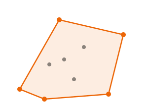
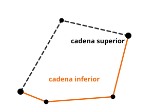

# Convex hull

{{ metadata() }}

La **envolvente convexa** de un conjunto de puntos es el menor polígono convexo que los
contiene a todos (imagina una goma elástica que se cierra alrededor de los puntos). El
algoritmo de **cadena monótona de Andrew** la calcula en O(n log n).

<figure class="algo-figure">
  
  <figcaption>Los puntos naranjas forman la envolvente; los grises quedan dentro.</figcaption>
</figure>

## Idea

Todo el algoritmo se apoya en una única operación: el **producto vectorial** (o producto
cruz) en 2D. Dados tres puntos `O`, `A` y `B`, el signo de `cross(O, A, B)` indica la
**orientación** del giro `O -> A -> B`:

- `> 0`: giramos a la **izquierda** (sentido antihorario, CCW),
- `< 0`: giramos a la **derecha** (sentido horario),
- `= 0`: los tres puntos son **colineales**.

Primero ordenamos los puntos por coordenada `x` (y por `y` en caso de empate). Barriéndolos
de izquierda a derecha construimos la **cadena inferior** y, de derecha a izquierda, la
**cadena superior**; al unirlas obtenemos la envolvente completa en sentido antihorario.
Ambas cadenas comparten los puntos con `x` mínima y máxima.

<figure class="algo-figure">
  
  <figcaption>Los dos extremos en x dividen la envolvente en cadena inferior y superior.</figcaption>
</figure>

Cada cadena se mantiene en una **pila**. Al añadir un punto nuevo, mientras los dos
últimos vértices de la pila más el nuevo **no** formen un giro a la izquierda
(`cross <= 0`), eliminamos el penúltimo: ese vértice quedaría "hundido" dentro de la
envolvente o sobre una arista, así que no le pertenece. Como cada punto se apila y se
desapila a lo sumo una vez, cada barrido es lineal.

!!! note "El test `<= 0` frente a `< 0`"
    Usar `<= 0` (en lugar de `< 0`) descarta también los puntos **colineales** sobre una
    arista, dejando solo los vértices imprescindibles. Si necesitas conservar esos puntos
    intermedios, cambia la comparación a `< 0`.

## Traza breve

Tomemos los puntos del ejemplo: el cuadrado `(0,0), (4,0), (4,4), (0,4)` con un punto
interior `(1,1)`. Ordenados por `x` (y por `y`): `(0,0), (0,4), (1,1), (4,0), (4,4)`.

En la cadena inferior, al llegar a `(1,1)` el giro `(0,0) -> (0,4) -> (1,1)` es a la
derecha, así que se descarta `(0,4)`; poco después `(1,1)` también cae al llegar `(4,0)`,
porque queda por encima del segmento `(0,0)-(4,0)`. La cadena inferior queda como
`(0,0) -> (4,0) -> (4,4)`. La cadena superior añade `(0,4)` y, al cerrarse, vuelve a
descartar el `(1,1)` interior. Resultado: los **4** vértices del cuadrado, justo lo que
comprueba el ejemplo.

## Código

{{ code_tabs() }}

## Complejidad

| Recurso | Coste |
|---------|-------|
| Tiempo | O(n log n) |
| Memoria | O(n) |

El coste está dominado por la **ordenación** inicial (`O(n log n)`); los dos barridos son
lineales, porque cada punto entra y sale de la pila a lo sumo una vez. La memoria es `O(n)`
para almacenar los vértices de la envolvente.

## Cuándo usarlo

Es la base de muchos problemas de geometría: perímetro o área mínima que encierra los
puntos, el par de puntos más lejano (diámetro), detección de puntos "extremos" o
envolturas para colisiones, y como primer paso de técnicas como *rotating calipers*.

## Cuándo NO usarlo

- Si necesitas **conservar** los puntos colineales de las aristas: usa `< 0` en el test del
  producto vectorial en lugar de `<= 0`.
- Con **muy pocos puntos** (< 3), donde la respuesta es trivial.
- Si el problema no es de "envolvente" propiamente dicho: muchos problemas geométricos se
  resuelven con el producto vectorial directo, sin construir la envolvente completa.

## Casos límite y errores comunes

- **Menos de 3 puntos**: no hay polígono; se devuelven los puntos tal cual.
- **Todos colineales**: la "envolvente" degenera en el segmento entre los dos extremos
  (2 vértices).
- **Puntos duplicados**: la versión en Python los elimina con `set(...)`; la de C++ no los
  filtra, aunque el test `<= 0` los trata igual que a los colineales. Si tu entrada puede
  traer duplicados y necesitas un recuento exacto, deduplica antes.
- **Desbordamiento**: el producto vectorial multiplica diferencias de coordenadas; con
  coordenadas grandes usa enteros de 64 bits (`long long`), como aquí, para no desbordar.
- **Orientación**: el signo del producto vectorial depende del sistema de ejes; con `y`
  hacia abajo (por ejemplo, en pantalla) izquierda y derecha se intercambian.

## Referencias

- [CP-Algorithms: Convex Hull (Andrew)](https://cp-algorithms.com/geometry/convex-hull.html)
- [Wikipedia: Convex hull algorithms (Andrew's monotone chain)](https://en.wikipedia.org/wiki/Convex_hull_algorithms)
