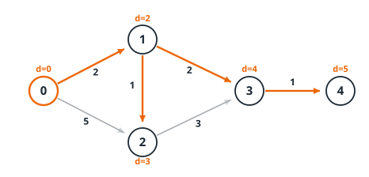

# Dijkstra

{{ metadata(extra="**Técnica:** Recorridos de grafos") }}

**Dijkstra** calcula el **camino más corto** desde un nodo origen a todos los demás en un
grafo con **pesos no negativos**, expandiendo siempre el nodo más cercano aún no fijado
con ayuda de una cola de prioridad.

<figure class="algo-figure">
  
  <figcaption>Árbol de caminos más cortos desde el nodo 0 (aristas naranjas). Junto a cada
  nodo, su distancia mínima final.</figcaption>
</figure>

## Idea

Mantenemos dos grupos de nodos: los **fijados** (cuya distancia mínima ya es definitiva) y
el resto, cada uno con una **distancia tentativa** `dist[v]` (la mejor conocida hasta ahora,
`∞` si aún no lo hemos alcanzado). En cada paso:

1. Sacamos de la cola el nodo no fijado con **menor** distancia tentativa y lo fijamos.
2. **Relajamos** sus aristas: para cada arista `u → v` de peso `w`, si `dist[u] + w` mejora
   `dist[v]`, actualizamos `dist[v]` y encolamos el nuevo valor.

La clave (y por qué es *voraz*): cuando extraemos el nodo `u` con la menor distancia
tentativa, esa distancia **ya es óptima**. Cualquier otro camino hasta `u` tendría que salir
por un nodo todavía no fijado, cuya distancia es `≥ dist[u]`; como los pesos son **no
negativos**, seguir por ahí solo puede sumar, nunca acortar. Por eso una vez fijado un nodo
no hace falta revisarlo: **ningún camino más barato puede aparecer después**.

Ahí está también el motivo de exigir **pesos no negativos**. Con una arista negativa, un
camino que empieza "caro" podría abaratarse más adelante, y habríamos fijado el nodo
demasiado pronto con un valor incorrecto. Para pesos negativos hay que usar
[Bellman-Ford](../bellman-ford/index.md).

## Código

{{ code_tabs() }}

!!! warning "Pesos no negativos"
    Dijkstra **no funciona con aristas de peso negativo**. En ese caso usa Bellman-Ford.

!!! note "Borrado perezoso (*lazy deletion*)"
    El *binary heap* no permite actualizar la prioridad de un nodo en O(log V), así que en vez
    de borrar la entrada antigua **encolamos una nueva** con la distancia mejorada. La cola
    acaba con entradas **obsoletas**: cuando sacamos `(d, u)` comprobamos `d > dist[u]` y, si
    se cumple, la descartamos (`continue`). Sin esa comprobación el resultado sigue siendo
    correcto, pero reprocesaríamos nodos ya fijados y el algoritmo iría más lento.

## Traza de ejemplo

Sobre el grafo dirigido de la figura, con origen `0`. Partimos de
`dist = [0, ∞, ∞, ∞, ∞]` y la cola `{(0,0)}`:

| Se extrae | Comprobación   | Aristas relajadas                       | `dist` tras el paso |
|-----------|----------------|-----------------------------------------|---------------------|
| `(0,0)`   | `0 = dist[0]`  | `0→1`: 2; &nbsp; `0→2`: 5               | `[0, 2, 5, ∞, ∞]`   |
| `(2,1)`   | `2 = dist[1]`  | `0→1→2`: 3 < 5 mejora; &nbsp; `1→3`: 4  | `[0, 2, 3, 4, ∞]`   |
| `(3,2)`   | `3 = dist[2]`  | `2→3`: 6 ≮ 4, nada                      | `[0, 2, 3, 4, ∞]`   |
| `(4,3)`   | `4 = dist[3]`  | `3→4`: 5                                | `[0, 2, 3, 4, 5]`   |
| `(5,2)`   | `5 > dist[2]=3`| **obsoleta** → se descarta              | `[0, 2, 3, 4, 5]`   |
| `(5,4)`   | `5 = dist[4]`  | 4 no tiene salientes                    | `[0, 2, 3, 4, 5]`   |

Fíjate en `(5,2)`: se encoló cuando `dist[2]` valía 5, pero luego mejoró a 3 por el camino
`0→1→2`. Al extraerla ya está caducada y el *skip* la ignora. Resultado: `0 2 3 4 5`.

## Complejidad

| Recurso | Coste |
|---------|-------|
| Tiempo | O((V+E) log V) |
| Memoria | O(V+E) |

Cada arista provoca como mucho una inserción en la cola y cada extracción cuesta O(log V);
con E aristas y V nodos, el total es O((V+E) log V).

## Cuándo usarlo

Es la opción por defecto para **camino más corto desde un origen** con pesos no negativos,
sobre todo en grafos dispersos. Compáralo con sus vecinos:

| Situación | Algoritmo | Coste |
|-----------|-----------|-------|
| Grafo **no ponderado** (todas las aristas cuestan lo mismo) | [BFS](../bfs/index.md) | O(V+E) |
| Pesos **no negativos**, un origen | **Dijkstra** | O((V+E) log V) |
| Hay **pesos negativos** (y detecta ciclos negativos) | [Bellman-Ford](../bellman-ford/index.md) | O(V·E) |

Si todas las aristas pesan igual, no necesitas la cola de prioridad: BFS da el mismo
resultado más rápido.

## Cuándo NO usarlo

- **Con pesos negativos** → usa [Bellman-Ford](../bellman-ford/index.md); Dijkstra puede
  fijar un nodo demasiado pronto y devolver distancias incorrectas.
- **En grafos no ponderados** → un [BFS](../bfs/index.md) da el mismo resultado en O(V+E),
  sin el coste extra de la cola de prioridad.
- **Para los caminos más cortos entre _todos_ los pares** a la vez → Floyd-Warshall suele
  ser más cómodo que lanzar Dijkstra desde cada nodo.

## Múltiples orígenes y destinos

### Múltiples orígenes

Para calcular, para cada nodo, la distancia al origen **más cercano** de un conjunto `S`,
**no** hace falta lanzar Dijkstra una vez por cada origen. Basta con **sembrar la cola con
todos los orígenes a la vez**: pon `dist[s] = 0` y encola `(0, s)` para cada `s ∈ S`, y
ejecuta el mismo bucle sin cambios. Entonces `dist[v]` es la distancia de `v` al origen más
próximo. El coste sigue siendo O((V+E) log V) — equivale a añadir un "súper-origen"
conectado a cada `s` con una arista de peso 0.

```cpp
for (int s : sources) { dist[s] = 0; pq.push({0, s}); }
// ...el resto del bucle es idéntico...
```

### Múltiples destinos

Dijkstra desde un origen ya calcula la distancia a **todos** los nodos, así que si te piden
varios destinos solo tienes que **leer `dist[t]`** para cada destino `t`: no repitas el
algoritmo. Si el grafo es enorme y solo te interesan unos pocos destinos, puedes **parar
antes**: cuenta cuántos destinos has fijado y sal del bucle en cuanto los hayas fijado
todos (recuerda que, al extraer un nodo de la cola, su distancia ya es definitiva). El caso
particular de **un único destino** es simplemente un `break` en cuanto lo extraes.

## Errores comunes

- **Aplicarlo con pesos negativos.** No da error, simplemente devuelve distancias erróneas.
- **Desbordamiento.** Con muchos pesos grandes, la suma de distancias puede pasarse de
  `int`; usa `long long` (por eso `INF = 1e18`, no `INT_MAX`).
- **Olvidar el *skip* de entradas obsoletas** (`if (d > dist[u]) continue;`): el resultado
  es correcto, pero el algoritmo reprocesa nodos y se ralentiza.
- **Grafo no dirigido:** hay que añadir cada arista en **ambos sentidos** al construir `adj`.

## Referencias

- [CP-Algorithms: Dijkstra](https://cp-algorithms.com/graph/dijkstra.html)
