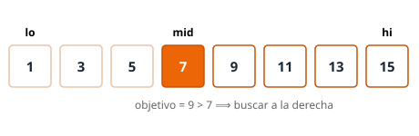

# Binary search

{{ metadata() }}

Busca un valor en un array **ordenado** dividiendo el espacio de búsqueda por la mitad en
cada paso. Devuelve la posición del valor, o `-1` si no está.

<figure class="algo-figure">
  
  <figcaption>Buscamos 9: como el central (7) es menor, el objetivo solo puede estar a la
  derecha, así que descartamos de golpe la mitad izquierda.</figcaption>
</figure>

## Idea

Al estar el array **ordenado**, comparar el objetivo con el elemento central nos dice en
qué mitad puede estar: si el central es *menor* que el objetivo, este solo puede estar a la
derecha; si es *mayor*, solo a la izquierda. Cada comparación descarta, por tanto, la mitad
de los candidatos que quedaban.

El bucle mantiene una **invariante** muy simple: si `target` está en el array, siempre se
encuentra dentro del rango `[lo, hi]`. Al principio ese rango es `[0, n-1]` y cubre todo el
array; cada iteración lo reduce a la mitad sin perder nunca el objetivo, hasta encontrarlo o
hasta que el rango queda vacío (`lo > hi`), señal inequívoca de que no está.

## Código

{{ code_tabs() }}

!!! warning "Precondición"
    El array debe estar **ordenado**. Si no lo está, ordénalo primero (O(n log n)).

## Cómo funciona

Sigamos la traza sobre `1 3 5 7 9 11` buscando el `7`:

| `lo` | `hi` | `mid` | `a[mid]` | Comparación | Acción |
|------|------|-------|----------|-------------|--------|
| 0 | 5 | 2 | 5 | `5 < 7` | `lo = mid + 1 = 3` |
| 3 | 5 | 4 | 9 | `9 > 7` | `hi = mid - 1 = 3` |
| 3 | 3 | 3 | 7 | `7 == 7` | devuelve `3` |

Con 6 elementos hemos necesitado solo 3 comparaciones. Dos detalles de la implementación
merecen atención:

- **`mid = lo + (hi - lo) / 2` evita el desbordamiento.** Da el mismo índice que
  `(lo + hi) / 2`, pero esta última puede desbordar el rango de `int` si `lo + hi` supera el
  máximo representable (con arrays muy grandes). Restar primero elimina esa suma peligrosa.
  En Python los enteros no desbordan, así que allí `(lo + hi) // 2` es igual de seguro.
- **Disciplina de los `+1` / `-1`.** Cuando `a[mid] < target` ya sabemos que `mid` *no* es
  la respuesta, así que lo descartamos con `lo = mid + 1`; de forma simétrica,
  `hi = mid - 1` cuando `a[mid] > target`. Si escribiéramos `lo = mid` o `hi = mid`, el
  rango podría dejar de encogerse y el bucle entraría en un ciclo infinito.

## Complejidad

Cada iteración descarta la mitad de los elementos, de modo que hacemos a lo sumo
⌈log₂ n⌉ comparaciones: de ahí el coste O(log n). Solo usamos un par de índices, por lo que
la memoria es O(1).

| Operación | Complejidad |
|-----------|-------------|
| Búsqueda | O(log n) |
| Memoria | O(1) |

## Ejemplos

| Array | Buscar | Resultado |
|-------|--------|-----------|
| `1 3 5 7 9 11` | `7` | `3` (posición) |
| `1 3 5 7 9 11` | `4` | `-1` (no está) |

## Búsqueda binaria sobre la respuesta

Una técnica muy habitual en concursos es la **búsqueda binaria sobre la respuesta**: en vez
de buscar un valor dentro de un array, buscamos el menor (o mayor) valor `x` que cumple una
condición **monótona** —una que, una vez se vuelve cierta, sigue siéndolo para valores
mayores—. La mecánica es idéntica: si sabemos comprobar rápido «¿basta con `x`?», hacemos
búsqueda binaria sobre el rango de respuestas posibles y bastan `O(log(rango))`
comprobaciones. Aparece en problemas del tipo «minimiza la capacidad máxima» o «¿cabe todo
en `k` grupos?».

## Cuándo NO usarlo

- **Una sola búsqueda en un array desordenado**: ordenarlo cuesta O(n log n); si solo vas a
  buscar una vez, un recorrido lineal O(n) es más simple y rápido.
- **Datos que cambian mucho** (inserciones/borrados frecuentes): mantener el array ordenado
  es caro. Un conjunto hash (`unordered_set` en C++, `set` en Python) responde a "¿está?"
  en O(1) medio sin reordenar nada.
- Para buscar **el primero ≥ x** o contar repetidos, usa las variantes `lower_bound` /
  `upper_bound`: siguen siendo búsqueda binaria, pero te evitan reescribir el bucle.

## Errores comunes

- Olvidar que el array debe estar **ordenado**: sin orden, `a[mid]` no dice nada sobre en
  qué mitad seguir buscando.
- Usar `<` en lugar de `<=` en la condición del bucle: se saltaría el último caso, cuando el
  rango se reduce a un único elemento (`lo == hi`).
- Escribir `lo = mid` o `hi = mid` en vez de `mid ± 1`, lo que provoca un bucle infinito.
- Calcular `mid` como `(lo + hi) / 2` en lenguajes con enteros de tamaño fijo: riesgo de
  desbordamiento con índices grandes.

## Referencias

- [CP-Algorithms: Binary search](https://cp-algorithms.com/num_methods/binary_search.html)
