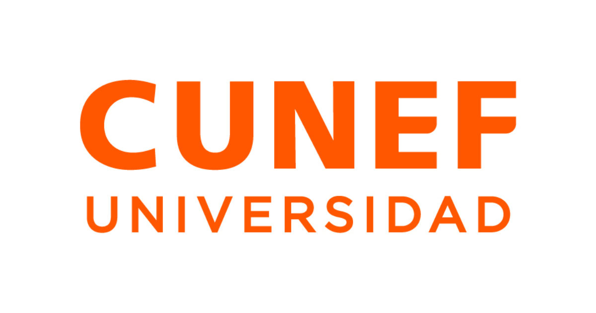
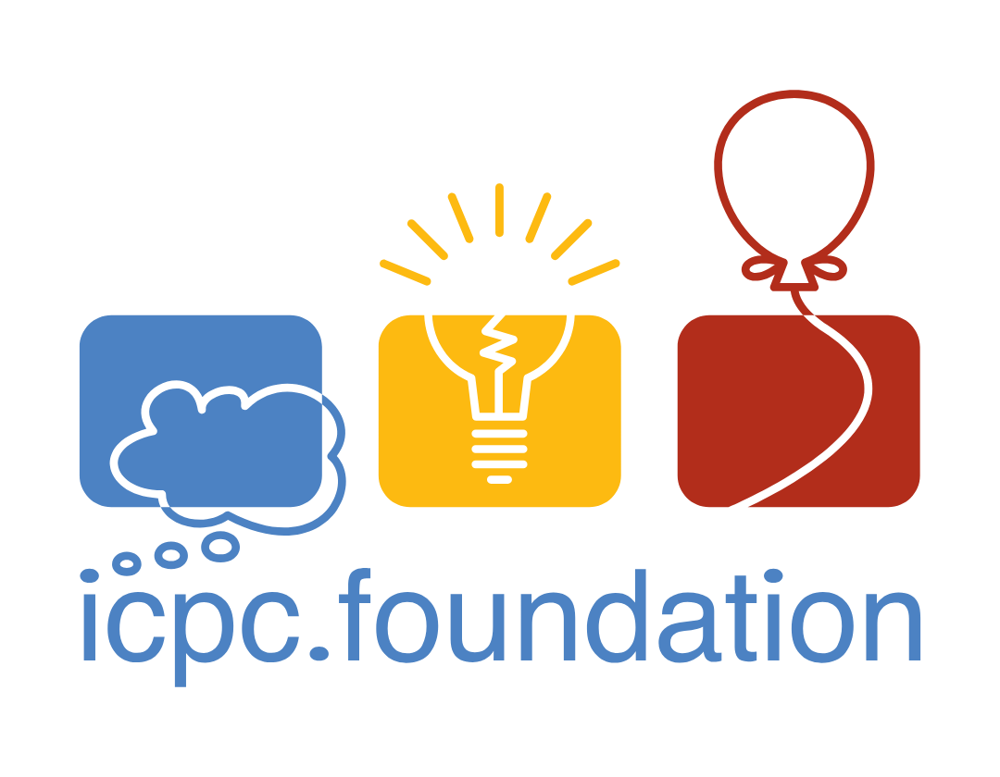
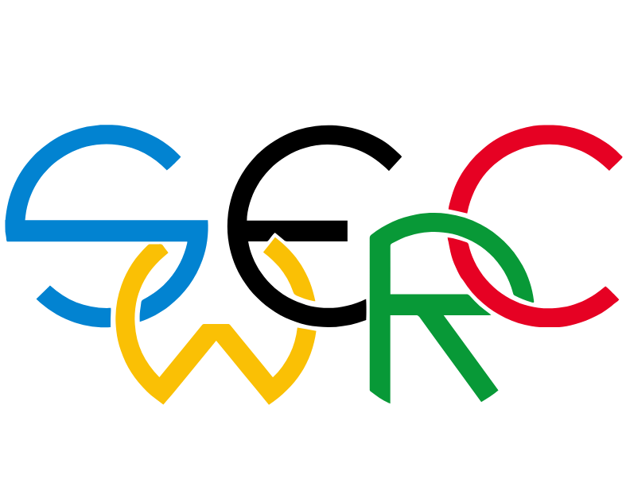
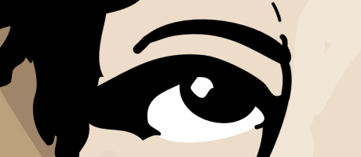

---
hide:
  - navigation
  - toc
---

{ .hero-logo }

# Programación Competitiva

Aprende a programar en **C++** y **Python** y llega a competir en concursos tipo **ICPC**.
Explicaciones claras, código listo para copiar y un chuletario para el día del concurso.

[Empezar aquí :material-rocket-launch:](start/onboarding.md){ .md-button .md-button--primary }
[Ver algoritmos](content/index.md){ .md-button }

## Los concursos

Estos son los concursos a los que apuntamos. Entrena con este material y anímate a formar
equipo.

-   [{ .contest-logo }](https://icpc.global/)

    __ICPC__

    El mayor concurso de programación universitario del mundo: equipos de tres personas
    resuelven problemas algorítmicos contra reloj.

    [Web oficial](https://icpc.global/){ .md-button }

-   [{ .contest-logo }](https://swerc.eu/)

    __SWERC__

    El regional del ICPC para el suroeste de Europa (España, Francia, Portugal, Italia…).
    La puerta de CUNEF hacia la final mundial.

    [Web oficial](https://swerc.eu/){ .md-button }

-   [{ .contest-logo }](https://ada-byron.es/2026/nac/)

    __Ada Byron__

    Concurso de programación competitiva en España, con fases locales y una final nacional.

    [Web oficial](https://ada-byron.es/2026/nac/){ .md-button }

## Elige tu nivel

-   :material-flag-outline:{ .lg } __Base__

    ---

    Primer contacto con la programación: entrada/salida, bucles, arrays.

    [:octicons-arrow-right-24: Base](content/levels/base/index.md)

-   :material-school-outline:{ .lg } __Principiante__

    ---

    Primeras técnicas de concurso: búsqueda binaria, dos punteros, voraz.

    [:octicons-arrow-right-24: Principiante](content/levels/beginner/index.md)

-   :material-database-outline:{ .lg } __Intermedio__

    ---

    Estructuras de datos y grafos: el núcleo de los concursos regionales.

    [:octicons-arrow-right-24: Intermedio](content/levels/intermediate/index.md)

-   :material-lightning-bolt:{ .lg } __Avanzado__

    ---

    Técnicas potentes: DP con máscaras, grafos avanzados, cadenas.

    [:octicons-arrow-right-24: Avanzado](content/levels/advanced/index.md)

-   :material-trophy-outline:{ .lg } __Experto__

    ---

    Temas de élite que marcan la diferencia en la final.

    [:octicons-arrow-right-24: Experto](content/levels/expert/index.md)

-   :material-map-outline:{ .lg } __¿Perdido?__

    ---

    Sigue el grafo de dependencias para saber qué aprender antes de cada tema.

    [:octicons-arrow-right-24: Grafo de dependencias](content/graph.md)

## Explora el proyecto

-   :material-book:{ .lg } __Contenidos__

    Técnicas, algoritmos, estructuras de datos y trucos de programación competitiva.

    [:octicons-arrow-right-24: Ver contenidos](content/index.md)

-   :material-podium:{ .lg } __Ranking__

    La clasificación de CUNEF en Kattis, con su evolución.

    [:octicons-arrow-right-24: Ver ranking](ranklist/index.md)

-   :material-file-document-outline:{ .lg } __Chuletario__

    Genera tu chuletario en PDF para el concurso.

    [:octicons-arrow-right-24: Ver chuletario](cheatsheet/index.md)

-   :material-account-heart-outline:{ .lg } __Contribuir__

    Añade tus propios algoritmos, paso a paso desde cero.

    [:octicons-arrow-right-24: Cómo contribuir](contributing/index.md)

## Autores

Proyecto mantenido por profesorado de CUNEF Universidad:

<ul class="authors" markdown>
- :material-account-tie: [Francisco Criado](https://www.cunef.edu/claustro-e-investigacion/criado-gallart-francisco/)
- :material-account-tie: [Javier París](https://www.cunef.edu/claustro-e-investigacion/paris-uhryn-javier/)
- :material-account-tie: [María Espinosa](https://www.cunef.edu/claustro-e-investigacion/espinosa-ruiz-maria-soledad/)
</ul>
