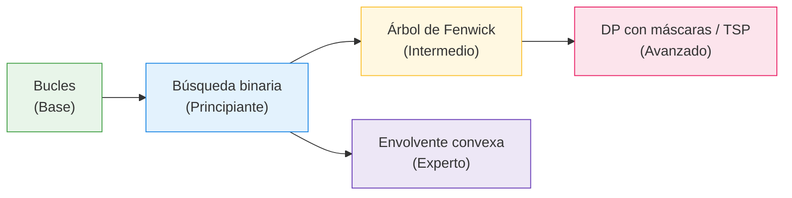

# Grafo de dependencias

Relación de prerrequisitos entre temas: sigue las flechas para saber qué aprender antes.
En la siguiente fase este grafo se generará automáticamente desde el campo `prereq` de
cada `meta.yaml`.

